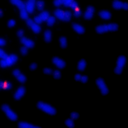
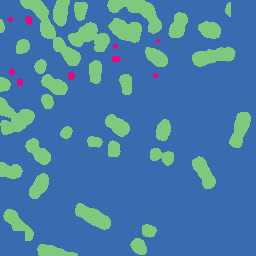
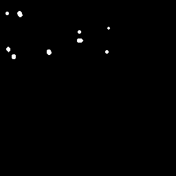

  <button class="dropdown-btn">&#9776;</button>
  

    <a href="https://drive.google.com/file/d/1fUlyA04YsPJrzd9bR7hXbBvEN6yPi5TV/view?usp=sharing" target="_blank">Report</a>
  

## About
Extrachromosomal DNA (ecDNA) is a key factor in tumor evolution and resistance to treatment, making its precise identification crucial for cancer diagnostics and prognosis. In our study, we explore the potential of large language models (LLMs) to replace or supplement pathologists in ecDNA identification using DAPI-stained cell images. We integrate MiniCPM, Qwen, and PixTral models into our workflow, leveraging their multimodal capabilities to process and interpret fluorescence microscopy data. Our approach involves N-shot learning and multi-layered prompts to refine model responses and enhance diagnostic accuracy. We evaluate the effectiveness of these models in recognizing ecDNA patterns and assessing their performance against expert pathological annotations. Our findings provide insight into the feasibility of LLM-assisted  pathology and highlight the challenges and advantages of using AI-driven approaches in medical imaging.
## Introduction
Our project focuses on analyzing and understanding extra chromosomal DNA (ecDNA). ecDNA exists outside the chromosomes in a cell. Unlike typical chromosomal DNA, which is organized within the chromosomes in the nucleus, ecDNA is typically found as circular pieces of DNA. It can exist in various forms, such as plasmids in bacteria or circular DNA in cancer cells.

In humans, ecDNA is often associated with cancer because it can carry genes that promote tumor growth, like oncogenes. Since it is separate from chromosomes, ecDNA can replicate independently, leading to an increased copy number of certain genes, which can make cancer more aggressive. Researchers study ecDNA to understand its role in genetic diseases, cancer progression, and drug resistance.

There aren't many tools available for analyzing images with ecDNA in detail. Current tools mostly focus on identifying ecDNA and doing basic measurements, but they don’t give information about the structure of ecDNA or analyze metaphase spreads to detect chromosomal abnormalities or genetic diseases. This makes it hard for researchers to fully understand their data and the role of ecDNA.

There are also models that generate text descriptions for general images, but they haven’t been specifically applied to biological images, creating an opportunity for new developments. Our solution aims to use large language models (LLMs) as virtual pathologists. These models will be informed by tools like ecSeg to provide more meaningful and detailed insights which will assist researchers.
## Data Collection
Our data is collected from the <a href="https://data.mendeley.com/datasets/m7n3zvg539/6">ecSeg repository</a>, where we use the `train_im` and `test_im` images. Connected component analysis is performed on the images to find the number of nuclei, chromosomes, and ecDNA using the `ndimage` method from the `scipy` library. This process is performed on train and test data, and these counts are then stored in CSV files and used as the truth data.

### Example Images

Actual Image            |  Colored Image            | Segmented Image
:-------------------------:|:-------------------------:|:--------------------:                                         
  |    | 

## Methods
We began by collecting our dataset from the ecSeg repository, which contains high-resolution DAPI-stained cell images annotated for extrachromosomal DNA (ecDNA) detection. Using this dataset, we applied various machine learning techniques to optimize the performance of MiniCPM, Qwen, and PixTral models in analyzing ecDNA patterns. Our approach involved the following techniques:

#### **N-Shot Learning**
N-shot learning allows models to generalize from a limited set of examples. We experimented with different values of N to determine the optimal number of examples needed for effective ecDNA recognition. By providing a few labeled DAPI-stained cell images along with their corresponding ecDNA annotations, we aimed to improve model accuracy and reduce the need for extensive labeled datasets.

#### **Multi-Layered Prompting**
We designed a multi-layered prompting strategy to refine model responses and guide them through a structured reasoning process. Instead of a single-step input-output approach, we broke down the analysis into multiple stages, such as:
Step 1: Identifying cell structures and segmenting the nucleus.
Step 2: Recognizing ecDNA patterns within the segmented regions.
Step 3: Validating and refining predictions based on confidence scores.
This hierarchical approach helped improve the interpretability and robustness of the model’s predictions.

#### **Temperature Adjustment**
To control the randomness and certainty of the model’s predictions, we fine-tuned the temperature parameter during inference. A lower temperature (e.g., 0.2) encouraged more deterministic outputs, making the model confident in its responses, while a higher temperature (e.g., 0.8) allowed for more variability and exploration of different interpretations. By adjusting the temperature dynamically, we balanced precision and diversity in model-generated insights.

#### **Aggregating Results Over Multiple Trials**
Since single-run predictions may be inconsistent or subject to noise, we aggregated results over multiple trials to enhance reliability. Each model was run several times on the same input data, and the final prediction was determined by majority voting or averaging confidence scores. This approach reduced the impact of outliers and ensured more stable and accurate ecDNA detection.

By combining these techniques, we aimed to enhance the effectiveness of LLMs in supplementing or replacing pathologists for ecDNA analysis. Our methodology provides a structured and adaptive framework for using AI in biomedical imaging tasks.

## Results

## Conclusion
 
